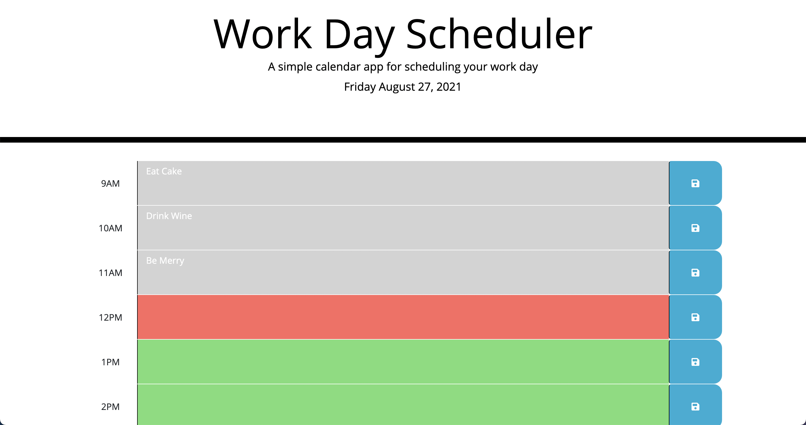

# Work Day Scheduler

[Link to finished website](https://lweine01.github.io/work-day-scheduler/)

## Table of Contents
- [Description](#Description)
- [Screenshots](#Screenshots)
- [Usage](#Usage)
- [Language](#language)

## Description
In this assignment, I created a work day scheduler. You are able to enter text into the input field for the time of day and click save. It then saves the content into the local storage so when the page is refreshed it stays in place.

## Screenshots

## Usage
To create an agenda for the day and save for future reference.

## Language
HTML, CSS, Javascript, and jQuery
